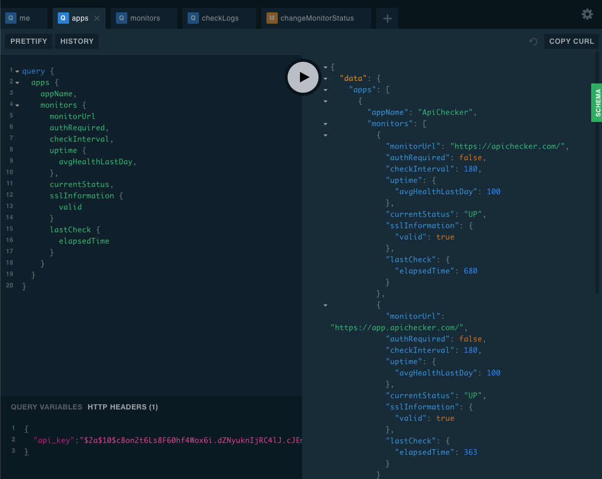

# ApiChecker API Documentation
Welcome to the ApiChecker open API documentation 👋
Below you will able to find quick summary of open API for ApiChecker.

We provide GraphQL backend that will ensure you have best quality API for your needs. 

# API Server URL / Playground
Currently API server located at this URL: [https://api.apichecker.com/graph/](https://api.apichecker.com/graph/)
We also have setup Playground editor for ApiChecker - so you can explore it using real data (from your account).
Also on this URL you will able to find the GraphQL Playground.

Playground allow you to create your own customizable queries using ApiChecker API


Don't forget to set HTTP headers on playground. HTTP header name is `api_key` where value is your access token.

!> Playground don't work without `api_key` header set. You still need to register your API Access Token first, and then put this token on 
HTTP headers section. Header name should be: `api_key`. 

# Get Started
You are invited to get started using ApiChecker. You may explore ApiChecker by:

* GraphQL ApiChecker API (primary way)
* Regular REST API
 
To start using our API you need create new API Token / Access token from your account.
To create Access Token follow below steps: 
* Open your account setting on APiChecker Dashboard: [Dashboard](https://app.apichecker.com/account/settings/api), 
* Enter your Access Token name
* Click to "Generate button"
* Copy and secure store token from field that will be showed below the button.


!> Please copy access token and store it in secure storage - you will not able to get it from dashboard later


## Access Token Header

Access token should be passed as part of every HTTP request to our API. 
Header example:
```text
api_key: $2axxxxxxx5qwg8ARwH5IMxnpR8X6Ko.P6x6dxxxxxxxxxxxxxxxxx123123
```

## Code examples

### HTTP request via regular REST API (nodejs):
```js
const request = require('request');
const serverUrl = "https://api.apichecker.com/graph/";
const accessToken = "xxxx10$c8onxxxxx8F60hf4Wox6i.dZNyuknIxxxxxC4lJ.cJEm2Efxxxxxx8pu";
const options = {
    url: serverUrl + "?query={me{name}}",
    headers: { 'api_key': accessToken }
};
request(options, (err, response, body) => {
    console.log(body);
    /*
    Will print: 
    {"data":{"me":{"name":"User Name"}}}
    * */
})
```

### HTTP request using GraphQL client:
And below example using graphql client `apollo-boost`.
This example retrieve list of Applications and their monitors via GraphQL query:

```js
require('cross-fetch/polyfill')
const gql = require('graphql-tag')
const Client = require('apollo-boost')

const client = new Client.default({
    uri: "http://localhost:3500/graph/",
    request: async operation => {
        operation.setContext({
            headers: {
                api_key: "ACCESS_TOKEN" ///set your access TOKEN
            }
        });
    },
})

client.query({  ///your query - you can generate it via Playgroud (you can find it in above url) as well.
    query:  gql`query {
        apps {
            appName,
            monitors {
                monitorUrl
                authRequired,
                checkInterval,
                uptime {
                    avgHealthLastDay,
                },
                currentStatus,
                sslInformation {
                    valid
                }
                lastCheck {
                    elapsedTime
                }
            }
        }
    }`})
.then(result => console.log(result.data));
```

And as result you will only get information that you request/need:

```json
{
  "data": {
    "apps": [
      {
        "appName": "ApiChecker",
        "monitors": [
          {
            "monitorUrl": "https://apichecker.com/",
            "authRequired": false,
            "checkInterval": 180,
            "uptime": {
              "avgHealthLastDay": 100
            },
            "currentStatus": "UP",
            "sslInformation": {
              "valid": true
            },
            "lastCheck": {
              "elapsedTime": 680
            }
          },
          {
            "monitorUrl": "https://app.apichecker.com/",
            "authRequired": false,
            "checkInterval": 180,
            "uptime": {
              "avgHealthLastDay": 100
            },
            "currentStatus": "UP",
            "sslInformation": {
              "valid": true
            },
            "lastCheck": {
              "elapsedTime": 380
            }
          }
        ]
      }
    ]
  }
}
```

# Pause uptime monitoring during deployment

You probably will want to pause monitoring during releases or deployments.
We have API for pause/resume monitoring - it's also served by GraphQL:

In case if you want to stop one monitor in application:
```graphql
mutation {
    changeMonitorStatus(monitorId: "{yourMonitorID}", enable: true, delay:20000)
}
```

In case if you want to stop whole application monitoring, including all nested monitors:
```graphql
mutation {
  changeApplicationStatus(applicationId: "{yourAppId}", enable: false, delay: 1000)
}
```

Where: 
* `monitorId` is your monitorID that you want to pause
* `applicationId` is your Application ID that you want to pause
* `enable` - true is you want to resume Monitoring, false if you want to pause it
* `delay` - count of milliseconds that ApiChecker should wait until request will take effect (change monitoring status)  

So in below example we will enable monitoring after 20000 milliseconds (one deploy will be completed totally). 

If you want to call it via normal/regular HTTP url, you can just use below CURL sample:

```curl
curl 'https://api.apichecker.com/graph' -H 'Content-Type: application/json' -H 'api_key: {YourAccessTOKEN}' --data-binary '{"query":"mutation {\n  changeMonitorStatus(monitorId: \"5c90908f147dfd00105961f3\", enable: false, delay:20000)\n}"}'
```

Or similar analog with POST request to /graph/ endpoint, where body will be QUERY.


# Custom GraphQL clients

You also can you any custom client to fetch data from ApiChecker or explore ApiChecker API.

As example you can use: 
* [Insomnia](https://insomnia.rest/graphql/) - MacOs, Windows, Linux
* [graphql-request](https://github.com/prisma/graphql-request) - js
* [Altair GraphQL](https://altair.sirmuel.design/) - Mac, Windows, Linux, Web, Chrome, Firefox
* any library for GraphQL communications for any language, such as: Swift, NodeJS, JS, Python, C#, etc

You will get rich autocomplete feature served by ApiChecker API, with documentation for every field and query.

As example, this is screenshot from `Insomnia` client when using ApiChecker API:


As you can see we have autocomplete feature for our queries, that make great developer experience.